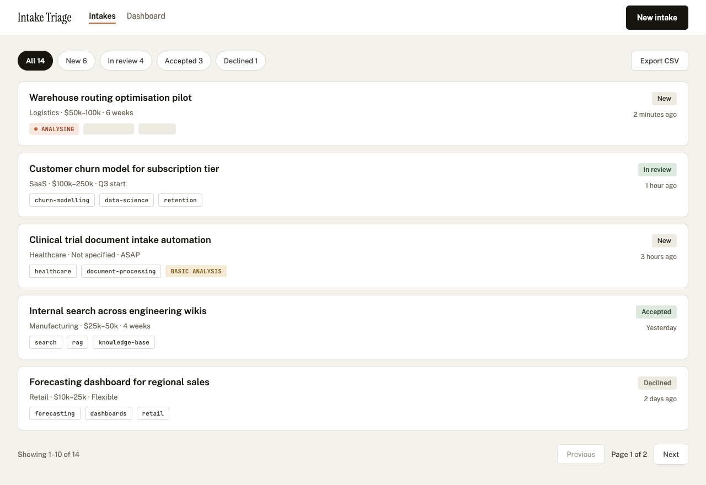
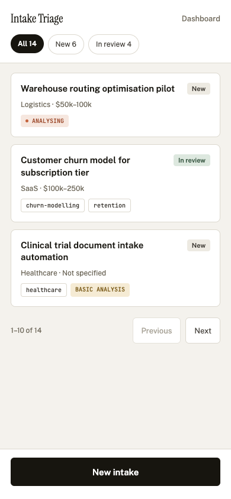
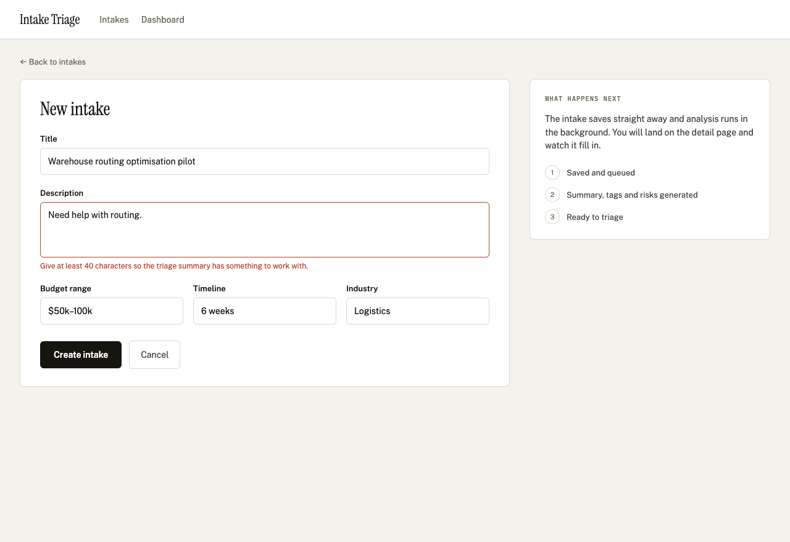
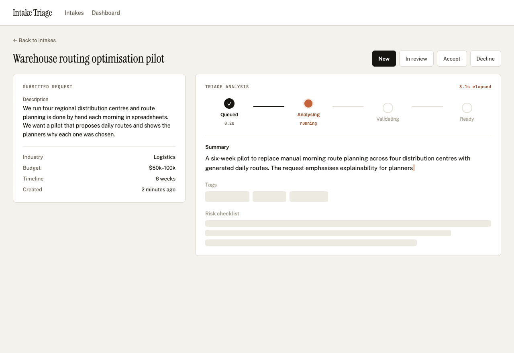
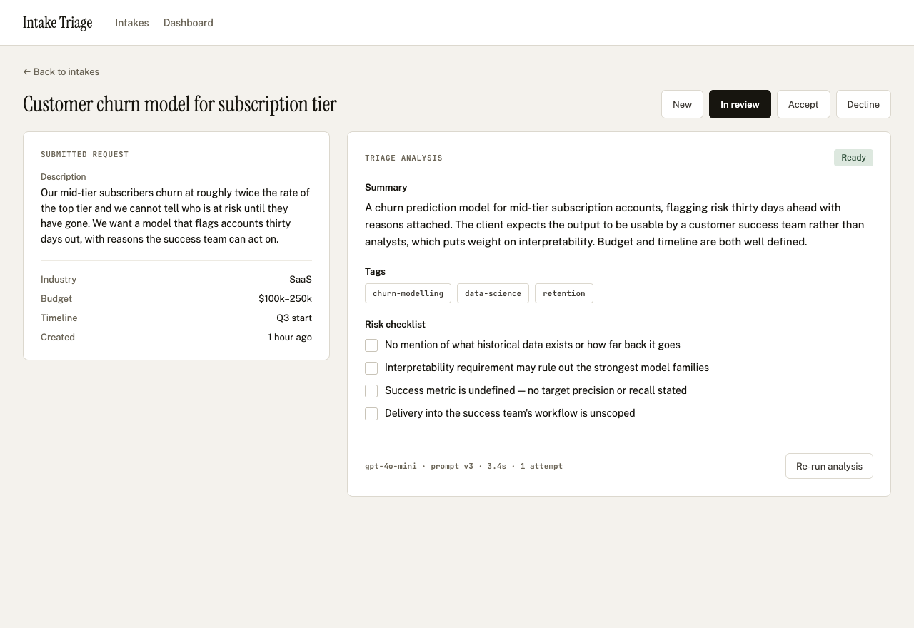
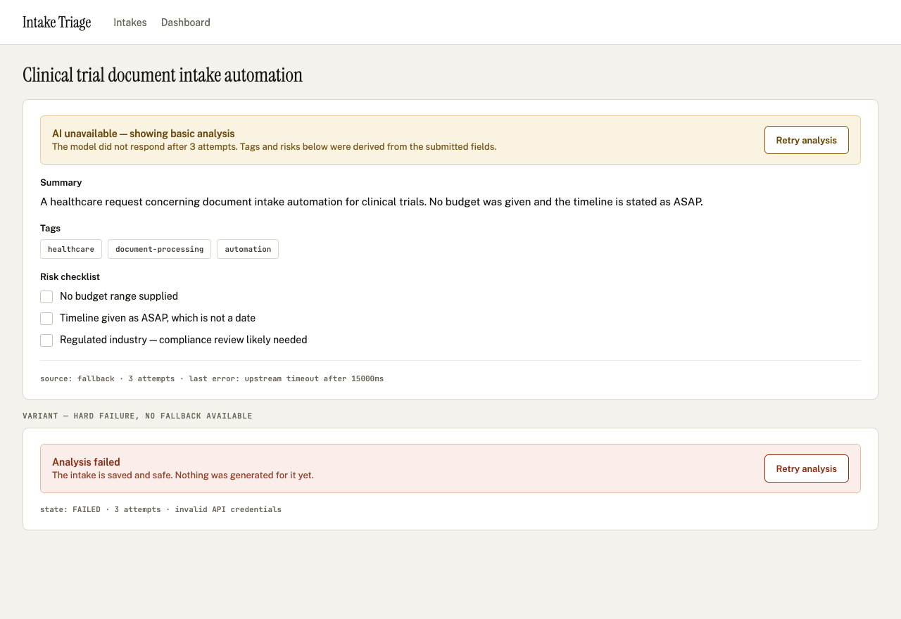
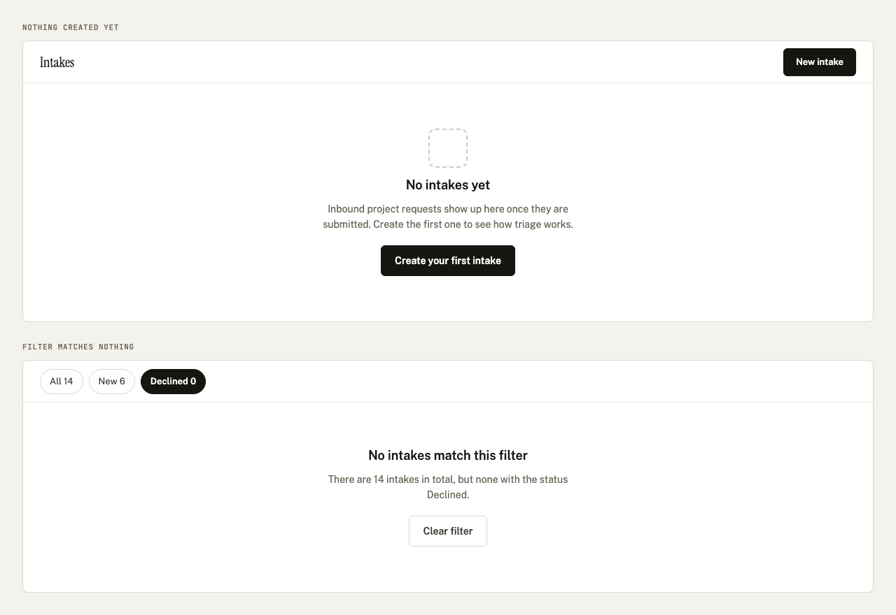
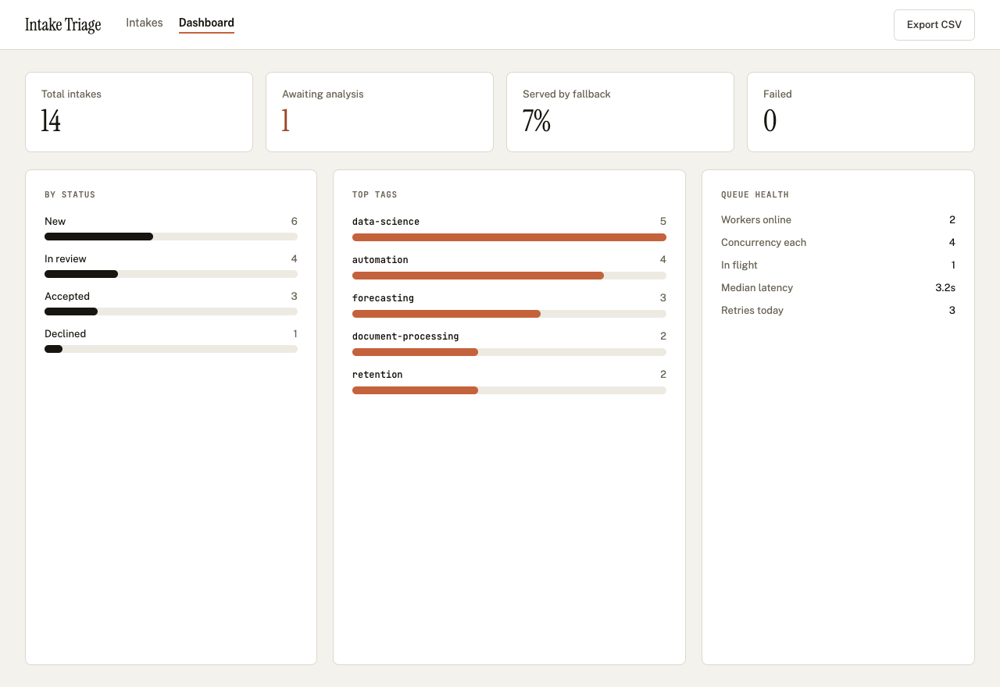

# Decisions

## The plan

I planned the whole build before writing code, then worked through it one phase at a time,
each phase its own PR.

- [`docs/design.md`](docs/design.md) is the implementation plan: scope, stack, data model, the
  queue and streaming designs, every task by phase, the demo moments, the tradeoffs and a cut
  list for if I ran long.
- [`docs/plan.md`](docs/plan.md) is the same plan as a checklist, ticked off as each phase landed.
  It's what I (and the agents) resumed from between sessions.
- [`docs/wireframes/`](docs/wireframes) holds the eight wireframes the frontend was built from:

| | |
| --- | --- |
|  List |  List on a phone |
|  Create, with a validation error |  Detail, analysis streaming in |
|  Detail, ready |  Detail, fallback and hard failure |
|  Both empty states |  Dashboard |

## Key decisions

The reasoning for each is in `docs/design.md`. The short version:

- **Next.js 15 with Route Handlers, not Server Actions.** The API stays a real, curl-able
  boundary between frontend and backend.
- **No broker.** The enrichment row is the job. Workers claim it with a compare-and-swap, hold it
  with a lease and heartbeat, and write results through a fencing token, so a worker that lost
  its lease can't overwrite a newer result. Run as many worker processes as you like.
- **SQLite, behind a `JobStore` interface.** It's what the brief recommends. It caps the workers
  at one host, and the interface is where a Postgres adapter would go.
- **An append-only event log streamed over SSE.** The event sequence number doubles as the
  resume cursor, so a dropped connection picks up where it left off. It's also an audit trail.
- **Structured output plus zod plus guardrails.** The model is held to a JSON schema, zod checks
  the response again on the way in, and guardrails fix the content (three tags, clamped summary,
  at most five risks).
- **A heuristic fallback, labelled as one.** When the model is out of chances the user still gets
  a basic analysis, and the page says clearly that that's what it is.
- **A triage status on every intake.** Without NEW / IN_REVIEW / ACCEPTED / DECLINED it's a list
  with summaries, not a triage tool.

## Verification

The README has a [Verification section](README.md#c-verification) that covers this in depth:
what the tests cover, how to run them, and a manual checklist.

In short, I checked it several ways:

- **QA in Chrome with Claude**, driving each flow in the browser at desktop, tablet and phone
  widths, with before and after screenshots on the UI PRs.
- **Playwright end-to-end tests** against a production build with a real worker process.
- **Unit and integration tests** in Vitest against a real SQLite database.
- **Evals.** Every analysis stores its prompt version, raw response, latency and token counts, and
  `npm run eval:dump` exports them for review.
- **Manual testing** of each flow as it was built, including the failure modes through
  `FORCE_AI_FAILURE`.

## Tradeoffs

- **No auth and no multi-tenancy.** I left both out because of time. It's built as a single-team
  internal tool.
- The rest of what I chose not to do, like the Postgres adapter, cursor pagination and a
  scoring harness for the evals, is listed with reasons under "Tradeoffs to name out loud" in
  `docs/design.md`.

## What I learned

I'd used zod before, but never this deeply. I found it really interesting how well it works,
and that it works full stack: one schema validates the form in the browser, validates the API
request on the server, checks the model's output, and validates the environment config at
startup.

## What I'd do differently in production

This treats the person who submits a project for review and the person who reads the agent's
analysis as the same person. In reality they'd almost certainly be two different people: a
client or salesperson submitting, and a delivery lead triaging. Merging them makes a very clean
proof of concept, but in a production app the flow would need to split. The submitter gets a
confirmation, and the analysis, risks and status buttons live behind the reviewer's view.

## With one more day

I'd add auth, which is also what the submitter and reviewer split above needs.
